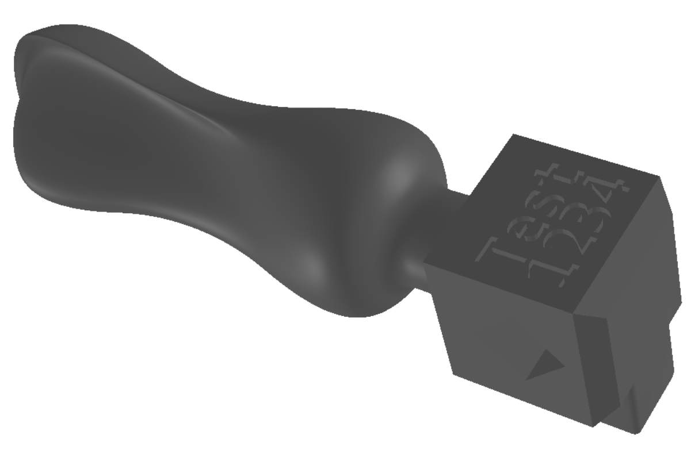

# Objects

Stimuli for visuo-haptic experiments.

The main idea is to use a small number of parameters to build a diverse range of smooth, watertight triangular meshes to be used in vision and haptic neuroscience studies. By using a small number of parameters, this construction method is compatible with a genetic algorithm approach to explore shape space.



## Installation

```bash
# Set up directory
git clone https://github.com/williamsnider/objects.git
cd objects

# Install objects
conda create --name objects_venv python=3.7
conda activate objects_venv_test
pip install -e .

# Install other packages from conda (compas easily installable via conda)
conda install -c conda-forge matplotlib trimesh rtree compas compas_cgal igl shapely opencv ipython ipykernel ipympl black pytest --yes
```
## Usage

```python
from objects.backbone import Backbone
from objects.cross_section import CrossSection
from objects.axial_component import AxialComponent
from objects.shape import Shape
import numpy as np

# Generate a backbone from controlpoints (quadratic b-spline)
backbone_cp = np.array(
    [
        [ 0.,  0.,  0.],
        [20.,  0.,  0.],
        [40.,  0.,  0.],
        [60.,  0.,  0.],
        [80.,  0.,  0.]
    ]
)
backbone = Backbone(controlpoints = backbone_cp, reparameterize=True)

# Generate cross sections of varying shape
c = np.cos
s = np.sin
round_cp = np.array(
    [
        [c(0 / 6 * 2 * np.pi), s(0 / 6 * 2 * np.pi)],
        [c(1 / 6 * 2 * np.pi), s(1 / 6 * 2 * np.pi)],
        [c(2 / 6 * 2 * np.pi), s(2 / 6 * 2 * np.pi)],
        [c(3 / 6 * 2 * np.pi), s(3 / 6 * 2 * np.pi)],
        [c(4 / 6 * 2 * np.pi), s(4 / 6 * 2 * np.pi)],
        [c(5 / 6 * 2 * np.pi), s(5 / 6 * 2 * np.pi)],
    ]
)
concave_cp = round_cp.copy()
concave_cp[-1] = [0.5, 0.5] 
cs0 = CrossSection(controlpoints = round_cp * 20, position = 0.1)
cs1 = CrossSection(controlpoints = concave_cp * 10, position = 0.5)
cs2 = CrossSection(controlpoints = concave_cp*20, position = 0.9)

# Generate an axial component, which uses the cross sections positioned along the backbone to form a quadratic b-spline surface
ac = AxialComponent(backbone=backbone, cross_sections=[cs0, cs1, cs2])

# Generate a shape (which can combine multiple axial components and surface deformations)
s = Shape([ac], label='Test_1234')
s.mesh.show()

# Fuse the shape to an interface (that the robotic arm can grasp)
s.create_interface()
s.fuse_mesh_to_interface()
s.mesh_with_interface.show()
```

## TODO List
1. Implement surface deformations
2. Improve tests (some currently require visual inspection)   

